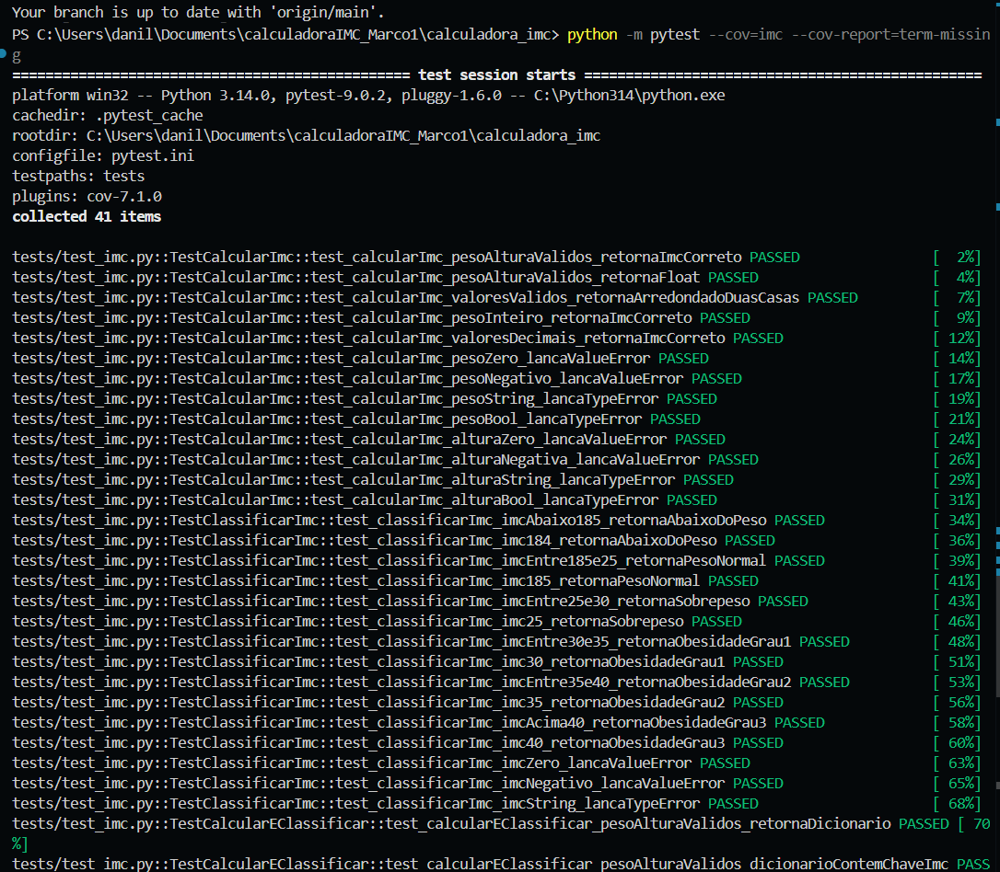
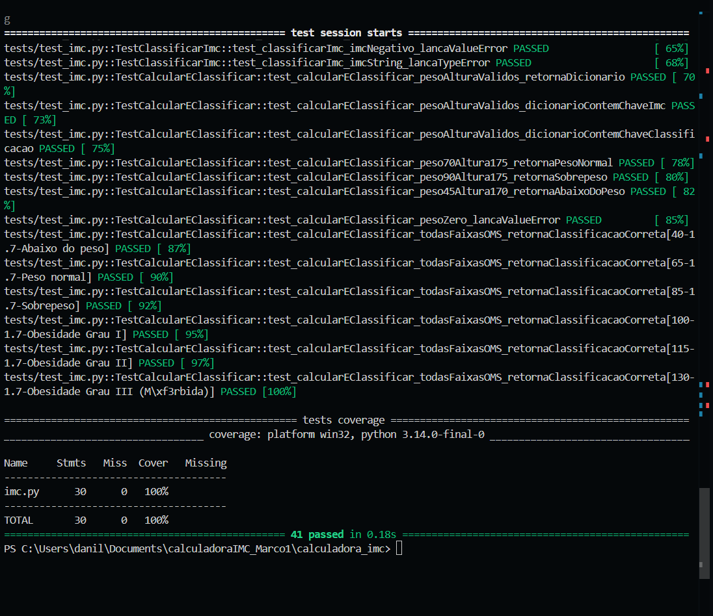

# 🏋️ Calculadora de IMC — Testes Unitários com pytest

**Disciplina:** Qualidade de Software  
**Professor:** Msc. Angelo F. Dias Gonçalves — UNIESP  
**Ferramenta:** Python + pytest + pytest-cov  
**Nível de Teste:** Teste de Unidade (Componente)

---

## 📌 Descrição

Aplicação Python que calcula e classifica o **Índice de Massa Corporal (IMC)** conforme a tabela da OMS, com suite completa de testes unitários automatizados.

---

## 📐 Regras de Negócio Testadas

| ID   | Regra                          | Detalhe                                              |
|------|-------------------------------|------------------------------------------------------|
| RN01 | Fórmula do IMC                | `IMC = peso (kg) / altura (m)²`                      |
| RN02 | Peso deve ser positivo        | Lança `ValueError` se peso ≤ 0                       |
| RN03 | Altura deve ser positiva      | Lança `ValueError` se altura ≤ 0                     |
| RN04 | Tipos obrigatoriamente numéricos | Lança `TypeError` se não for número               |
| RN05 | Resultado arredondado         | 2 casas decimais                                     |
| RN06 | Abaixo do peso                | IMC < 18.5                                           |
| RN07 | Peso normal                   | 18.5 ≤ IMC < 25.0                                    |
| RN08 | Sobrepeso                     | 25.0 ≤ IMC < 30.0                                    |
| RN09 | Obesidade Grau I              | 30.0 ≤ IMC < 35.0                                    |
| RN10 | Obesidade Grau II             | 35.0 ≤ IMC < 40.0                                    |
| RN11 | Obesidade Grau III (Mórbida)  | IMC ≥ 40.0                                           |
| RN12 | IMC deve ser positivo         | Lança `ValueError` se IMC ≤ 0                        |

---

## 🗂️ Estrutura do Projeto

```
calculadora_imc/
├── imc.py               # Código-fonte da aplicação
├── requirements.txt     # Dependências
├── pytest.ini           # Configuração do pytest
├── README.md            # Este arquivo
└── tests/
    ├── __init__.py
    └── test_imc.py      # Suite completa de testes unitários
```

---

## ⚙️ Como executar

### 1. Instalar dependências
```bash
pip install -r requirements.txt
```

### 2. Rodar os testes
```bash
python -m pytest
```

### 3. Rodar com relatório de cobertura
```bash
python -m pytest --cov=imc --cov-report=term-missing
```

### 4. Gerar relatório HTML de cobertura
```bash
python -m pytest --cov=imc --cov-report=html
```

---

## 🧪 Sobre os Testes

Os testes cobrem 3 cenários para cada função:
- ✅ **Valores válidos** — entradas corretas com resultado esperado
- ❌ **Valores inválidos** — entradas erradas que devem lançar exceção
- 🎯 **Valores-limite** — bordas exatas de cada faixa da OMS

**Total de testes:** 41 casos  
**Cobertura esperada:** 100% das linhas do `imc.py`

## 📸 Relatório de Cobertura



